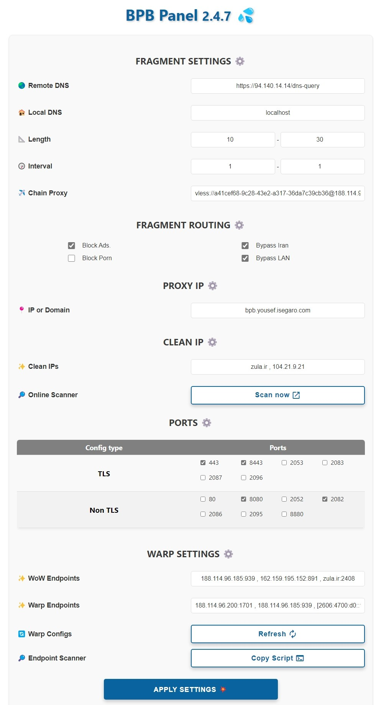

<h1 align="center">💦 BPB Panel</h1>

### 🌏 Readme in [English](README_en.md)

  

 

##介绍
该项目致力于开发一个用户面板 [Cloudflare-workers/pages proxy script](https://github.com/yonggekkk/Cloudflare-workers-pages-vless) 由...制作 [yonggekkk](https://github.com/yonggekkk). 该面板提供两种部署选项：
- **Worker** 部署
- **Pages** 部署
 

🌟 如果你发现 **BPB Panel** 很有价值，请你为原作者捐赠，你的捐赠将带来巨大的改变 🌟
- **USDT (BEP20):** `0x111EFF917E7cf4b0BfC99Edffd8F1AbC2b23d158`

## 特征

1. **免费**：无需任何费用。
2. **用户友好面板**：设计用于轻松导航、配置和使用。
3. **支持片段**：提供对片段功能的支持。
4. **屏蔽广告和色情内容（可选）**
5. **绕过伊朗和 LAN（可选）**
6. **完整路由规则**：为 Sing-box 绕过伊朗、屏蔽广告、恶意软件、网络钓鱼……。
7. **链代理**：能够添加链代理来修复 IP。
8. **支持广泛的客户端**：为 Xray 和 Sing-box 核心客户端提供订阅链接。
9. **订阅链接（JSON）：为 JSON 配置提供订阅链接。
10. **密码保护面板**：使用密码保护来保护您的面板。
11. **自定义 Cloudflare 干净 IP：**能够使用在线扫描仪并设置干净 IP 域。
12. **Warp 配置：**提供 Warp 和 Warp on Warp 订阅。
 

## 如何使用：
- [安装（Pages）](docs/pages_installation_fa.md)

- [安装（Worker）](docs/worker_installation_fa.md)

- [如何使用](docs/configuration_fa.md)

- [常见问题](docs/faq.md)
 

## 支持的客户端
| 客户端 | 版本 | 片段 |
| :-------------: | :-------------: | :-------------: |
| **v2rayNG** | 1.8.19 或更高版本 | :heavy_check_mark: |
| **v2rayN** | 6.42 或更高版本 | :heavy_check_mark: |
| **Nekobox** | | :x: |
| **Sing-box** | 1.8.10 或更高版本 | :x: |
| **Streisand** | | :heavy_check_mark: |
| **V2Box** | | :x: |
| **Shadowrocket** | | :x: |
| **Nekoray** | | :heavy_check_mark: |
| **Hiddify** | | :x: |

---

## 观星者随时间变化

---

### 特别感谢
- CF-vless 代码作者 [3Kmfi6HP](https://github.com/3Kmfi6HP/EDtunnel)
- CF首选IP程序作者【badafans】(https://github.com/badafans/Cloudflare-IP-SpeedTest), [XIU2](https://github.com/XIU2/CloudflareSpeedTest)

---

核心脚本详细教程请参考【永哥的博客及视频教程】(https://ygkkk.blogspot.com/2023/07/cfworkers-vless.html).
